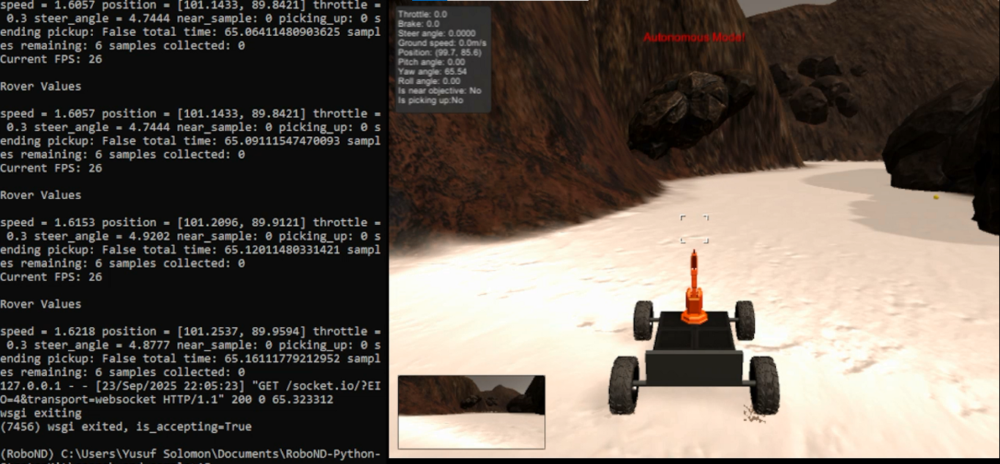

# Autonomous Search and Sample Return Rover 🚀

This project implements an **autonomous navigation pipeline** for a rover in the [Udacity Robotics NanoDegree simulator](https://github.com/udacity/RoboND-Rover-Project).  
The rover explores an environment, maps the terrain, collects samples (yellow rocks), and returns to its starting point. It is a Search and Sample Return Problem and this repo contains my solution for the problem, including my precision step, decision step, modifications i made to the Rover Object and also the supporting funcitons.

---

## 🎯 Key Features
- **Perception Pipeline**:  
  - Detects navigable terrain, obstacles, and rock samples from camera images.  
  - Updates a world map with explored regions.  

- **Decision Making**:  
  - Rule-based algorithm (wall-crawling + exploration).  
  - Prioritizes rock collection when detected.
  - Tracks last 10 positions to detect when stuck and goes in reverse when stuck
  - Drops all previous commands and moves forward every 10 seconds, to avoid moving in a circular path  
  - Implements "return to home" using path backtracking.  

- **Autonomous Coverage**:  
  - Achieves ~97% terrain mapping on average.  
  - Avoids getting stuck with recovery strategies.
  - There are usualy 6 samples to collect, the algorithm finds and collects at least 5 samples on average.  

---

## 📂 Project Structure
```
code/
├── drive_rover.py          # Main script for communication with simulator
├── decision.py             # Rover decision logic (navigation & sample pickup)
├── perception.py           # Image processing & mapping
├── supporting_functions.py # Utility functions for transformations & vision
media/
├── rover_demo.gif          # A sample run using my algorithm
├── SSR_pic.png             # Screenshot of my setup
Readme.md                   # Readme markdown file 
```

---

## 📸 Demo

  
*My environment setup*

  
*Rover autonomously exploring and collecting samples.*

---

## ⚙️ How It Works
1. **Perception Step**  
   - Thresholding and perspective transform to identify terrain and obstacles.  
   - Rock detection via color thresholding (yellow range).  
   - Mapping: Updates detected regions in a world map.  

2. **Decision Step**  
   - If enough navigable terrain is visible → move forward with bias to the leftmost navigable terrain (This can cause moving in circles).  
   - If blocked → stop, rotate, or backtrack.  
   - If rock detected → navigate towards it and trigger pickup.
   - Move Forward every 15 seconds to avoid going in circles.
   - track last 10 positions to detect when stuck and reverse when detected. 
   - When 95% of the map is covered or all samples have been collected → return home via path history.  

3. **Return to Home**  
   - Rover stores its traversed path.  
   - Replays the path in reverse to reach the starting point safely. 
   - When a particular distance from home, stop moving completely. 

---

## 🙌 Author
**Yusuf Solomon** – Mechatronics Engineer, passionate about Robotics & AI.  
[LinkedIn](https://www.linkedin.com/in/yusuf-solomon) | [Twitter/X](https://x.com/I_BadaSZ)

--
## Resources gotten from :  [Udacity Robotics NanoDegree simulator](https://github.com/udacity/RoboND-Rover-Project). 